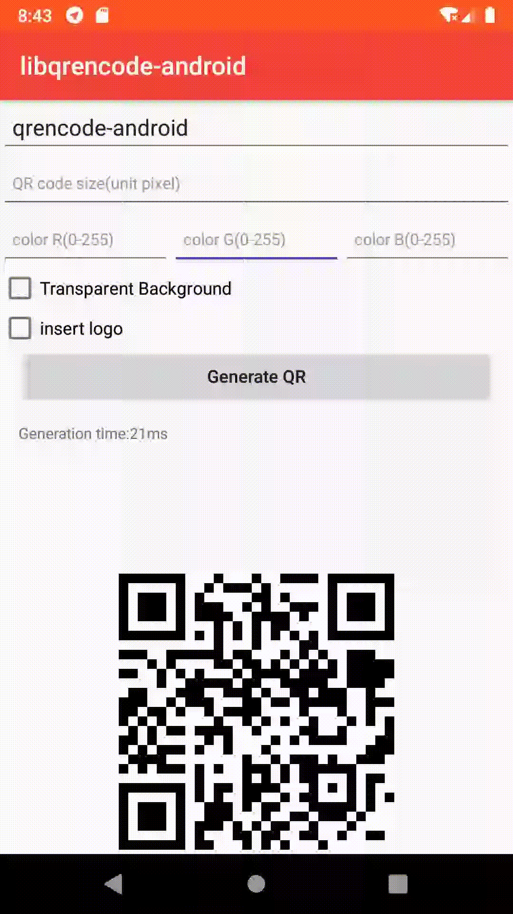

[  ](https://bintray.com/zhangchuan622/maven/libqrencode-android/1.0.3/link)

This is an efficient and fast QR code encoding framework for the Android platform. The encoding scheme comes from[libqrencode](https://github.com/fukuchi/libqrencode)，The project is to encapsulate libqrencode to facilitate QR code encoding on Android.




### How do I use libqrencode?
Add dependencies in build.gradle

```
implementation 'com.ben.android:libqrencode-android:1.0.3'
```

### How to code?
Just one line of code

- Generate a QR code

```
Bitmap bitmap = QREncode.encode(qrsource, qrsize, color);
```

- Generate QR code with Logo

```
Bitmap bitmap = QREncode.encode(qrsource, prescaler, logo);
```

- Fill QR code with pictures

```
Bitmap bitmap = QREncode.encodeOverlay(qrsource, qrsize, bgcolor,overlay,logo);
```


### Compile & install 
It is recommended to add library as a dependency to the project for coding, and you can also extract C and JNI related code for compilation.

- android-ndk-r16b

Make sure NDK has been added to the system environment variables. Go into the library directory and execute
```
ndk-build
``` 
Finally, copy the compiled so library and QREncode into your project.


### Compile Android platform from libqrencode 

- Android Studio

Create the JNI directory, copy all the files in the libqrencode directory to the JNI directory, copy cmake / CMakeLists.txt to libqrencode and replace, configure the NDK version, and start compiling.